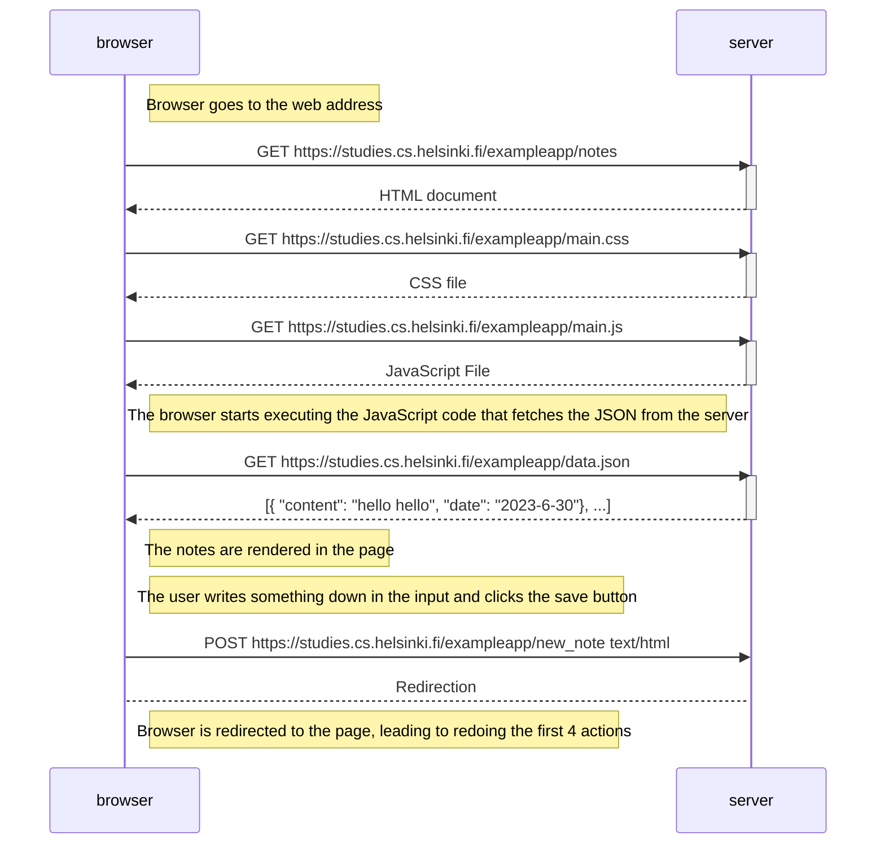

Task 0.4

```mermaid
sequenceDiagram
    participant browser
    participant server

    Note right of browser: Browser goes to the web address
    browser->>server: GET https://studies.cs.helsinki.fi/exampleapp/notes
    activate server
    server-->>browser: HTML document
    deactivate server

    browser->>server: GET https://studies.cs.helsinki.fi/exampleapp/main.css
    activate server
    server-->>browser: CSS file
    deactivate server

    browser->>server: GET https://studies.cs.helsinki.fi/exampleapp/main.js
    activate server
    server-->>browser: JavaScript File
    deactivate server

    Note right of browser: The browser starts executing the JavaScript code that fetches the JSON from the server

    browser->>server: GET https://studies.cs.helsinki.fi/exampleapp/data.json
    activate server
    server-->>browser: [{ "content": "hello hello", "date": "2023-6-30"}, ...]
    deactivate server

    Note right of browser: The notes are rendered in the page

    Note right of browser: The user writes something down in the input and clicks the save button

    browser->>server: POST https://studies.cs.helsinki.fi/exampleapp/new_note text/html 
    activate server
    server-->browser: Redirection

    Note right of browser: Browser is redirected to the page, leading to redoing the first 4 actions
```